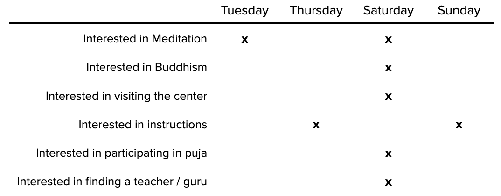

  
  

# Background

- Understand focus on different key target groups
- Establish and maintain regular schedule

# Experiential Objectives

TBA

## Importance of Target Group Thinking

Each target group has a different motivation (e.g. wants to learn to meditate), different ability (e.g. have never meditated before), and will respond to different kinds of triggers (e.g. might not be responsive to typical dharma talks initially). Tibetan Buddhism was propagated for the first 1,200 years almost exclusively in Tibet, and surrounding areas, where almost everyone born into a devout Buddhist family. The situation in the west, particularly in some countries, is starkly different. This needs to be taken into consideration by Dharma propagators in planning schedules and the individual activities that make up the program. The simplest way to start thinking about segmentation, a way that is already widely used in western Dharma centers, is segmenting based on the interest the person has. 

### 6 Types of Interest on Dharma Center Activity

- Interested in Meditation
- Interested in Buddhism
- Interested in visiting the center 
- Interested in instructions
- Interested in participating in puja
- Interested in finding a teacher / guru

There is an additional interest type, related with people who are interested in contributing as volunteers, for example in “food drives”, but we will not consider this type now. Another way to segment people would be based on their experience level. This way is also widely used in Dharma centers in the west. 

### 4 Levels of Modern Lay Practitioners

- No previous practice experience 
- Early beginner 
- Beginner with some years of practice 
- Adept (already completed Ngondro)

Given that many countries have only a handful of people who have completed Ngondro, generally it will not be useful to segment further than these four. Another way is to focus on the membership status of the person. 

### 3 Stages of Membership

- Unlikely to become a member
- Likely to become a member
- Already a member 

Those who are not members, can be further expressed as those that have been members in the past, and those that have not. Besides membership, another way to segment is based on participation level. 

### 3 Levels of Participation

- First time
- Infrequent
- Frequent

Finally, in this respect it should also be considered that some people are volunteering in various tasks and others are not. Membership level is less relevant in the context of scheduling, and more in terms of communication and some other aspects such as various member benefits, keeping active members motivated and so forth, preparing for contributing members’ changing life situations (e.g. having a child and no longer having time to volunteer). tly 

A very important aspect that is easily overlooked, is related with how people offer various resources. The resources can be categorized into three; time, money, and other resources.

### 6 Kinds of Patronage Profiles

- Offer time
- Offer money
- Offer other resources 
- Offer time and money
- Offer time and other resources 
- Offer time, money and other resources

While these too may not be so relevant for regular programming / schedules, it’s important to find ways to appreciate those that are contributing resources to Dharma activity, and also to attract new people that meet the profile.

## Importance of Regularity in Scheduling

There are two aspects to regular scheduling; having similar activity take place each week, and, having several weeks (or months) planned ahead. The most important argument in favor of regularity is the strong emphasis on establishing routines for Dharma practitioners, and the way those routines support progress. In addition, there are several secondary arguments in favor of regular scheduling: 

- Allows practitioners to establish routines 
- Gives people the ability to participate more when they want to 
- Establishes an impression of an active center 

## An Example Schedule

The first consideration should be on feasibility; is it possible to sustain the proposed schedule? Feasibility has several considerations: 

- How many hours in total it will require to manage each week?
- Can some parts of the program be done without Lama? 

In this example schedule we are applying the 6 Types of Interest on Dharma Center Activity. As the below table clearly shows, with such a simple schedule of less than 10 hours of activity per week, spread across 4 separate days, we are effectively covering the needs of each target segment.  

A matrix/table such as this could be used to make sure that the weekly / monthly program is sufficiently addressing the needs of the segments that are being targeted. Depending on the objectives of the activity, the segments and emphasis on each segment could greatly vary. 

## Uniqueness

Everything else outlined in this document, even the smallest detail and simplest instruction, would be underpinned by the objectives of the center (or other Dharma activity). For example, a well-established Dharma center with a long-standing resident Lama that is fluent in the local language, would have completely different objectives than a meditation group hosted in public spaces. Largely both benefit from similar means, but executed in completely different way. Whereas both would in most cases want to utilize Facebook and particularly Facebook advertising in various ways, each would do it differently, emphasizing different aspects. Another example is how one would not benefit from the target segmentation of the other. 

2021 | [Lotus King Trust](https://lotuskingtrust.org)
